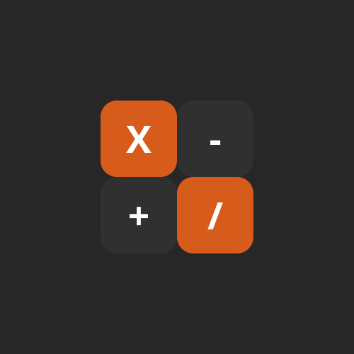

# 👨🏻‍💻Calculadora para android

 <h2>Características</h2>
  <ul>
   <li>Compatible con las orientaciones de pantalla.</li>
   <li>Compatible con los diferentes tamaños desde pantalla pequeña hasta tamaño de escritorio.</li>
   <li>Operaiones básicas.</li>
   <li>Falta la implementación del registro (solo muestra por log).</li>
  </ul>

  

 
 
 
  
  
 

 

